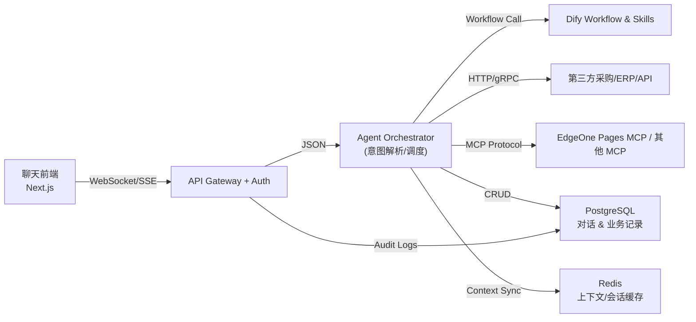
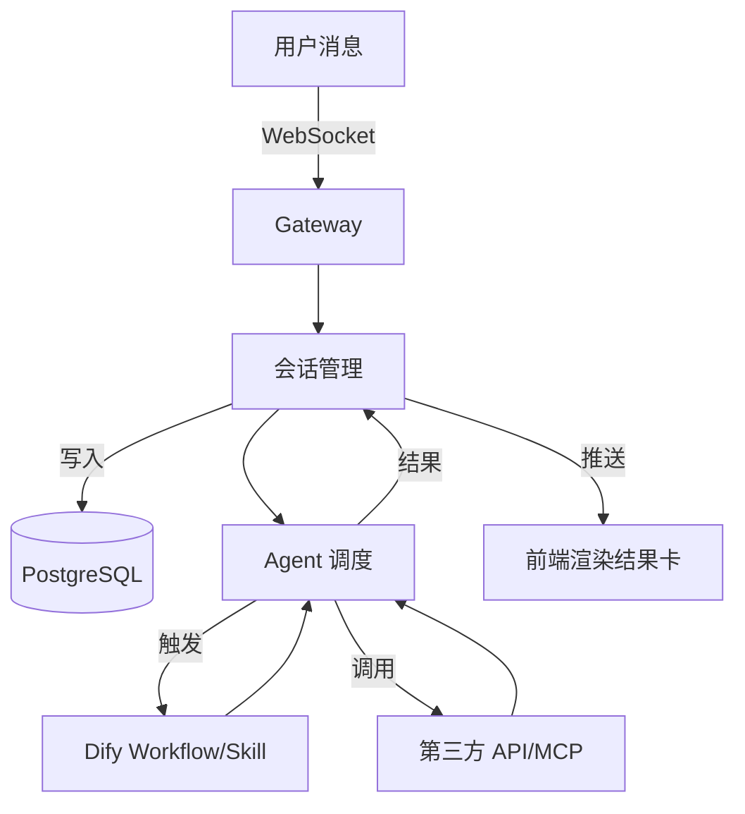

## Product Overview

重构 ProcureAI 为对话中心的 B2B+B2C 采购助手，用户通过单一聊天界面发起询价、比价与下单请求，Agent 在后台调度 Dify Workflow、技能与第三方 API，界面呈现沉浸式聊天气泡、上下文概览与结果卡片。

## Core Features

- 统一对话入口：实时气泡聊天、上下文摘要区与快捷指令面板
- B2B/B2C 智能采购：支持询价、供应商匹配、库存校验与消费者订单协助
- 工作流调度：Agent 根据意图自动触发 Dify Workflow、技能与外部 API 并反馈进度
- 数据留痕：后台记录每次对话、调用轨迹与结果，为审计与分析提供依据

## Tech Stack

- 前端：Next.js + TypeScript + Tailwind CSS，集成 WebSocket/SSE 聊天与组件动画
- Agent Orchestrator：Node.js（NestJS）服务对接 Dify Workflow、Skill、MCP 与外部 API
- 数据层：PostgreSQL 存储对话、动作与业务实体；Redis 用于上下文缓存
- 通信协议：HTTP/REST + WebSocket，内部 Agent 事件总线使用 gRPC 或 NATS

## Architecture



## Module Division

- **对话前端模块**
- 职责：聊天界面、上下文轨迹、结果卡片展示与快捷操作
- 依赖：Chat API、Streaming 事件
- 接口：/api/chat、/api/context
- **会话管理模块**
- 职责：身份校验、上下文合并、消息持久化
- 技术：Next.js API Routes / NestJS Gateway，Redis
- 接口：POST /chat, GET /session/:id
- **Agent 调度模块**
- 职责：意图识别、任务分解、Dify Workflow/Skill/MCP 调用编排
- 依赖：NLP 模型、Dify API、MCP Adapter
- 接口：内部 gRPC/事件，外部 Dify REST
- **外部服务集成模块**
- 职责：对接采购、供应链、支付等第三方 API
- 接口：REST/GraphQL，根据供应商规范
- **数据与审计模块**
- 职责：会话记录、动作日志、业务单据、可视化报表
- 接口：PostgreSQL schema，提供查询 API

## Data Flow



## Implementation Details

### 目录结构

```
procureai-agent/
├── apps/web/
│   ├── src/
│   │   ├── components/
│   │   ├── app/(chat)/
│   │   ├── hooks/
│   │   ├── libs/
│   │   └── styles/
├── services/agent-core/
│   ├── src/
│   │   ├── modules/
│   │   ├── workflows/
│   │   ├── adapters/
│   │   ├── repositories/
│   │   └── main.ts
├── packages/shared/
│   ├── types/
│   └── utils/
└── infra/
    ├── docker/
    └── scripts/
```

### 关键数据结构

```typescript
interface ConversationSession {
  id: string;
  userId: string;
  channel: "web" | "api";
  locale: string;
  status: "active" | "archived";
  createdAt: string;
  updatedAt: string;
}

interface AgentAction {
  id: string;
  sessionId: string;
  stepType: "intent" | "workflow" | "skill" | "api" | "mcp";
  payload: Record<string, any>;
  status: "pending" | "running" | "success" | "failed";
  startedAt: string;
  finishedAt?: string;
}

interface ProcurementRequest {
  id: string;
  sessionId: string;
  businessType: "B2B" | "B2C";
  items: Array<{
    sku: string;
    quantity: number;
    spec?: string;
  }>;
  preferredVendors?: string[];
  status: "draft" | "quoted" | "ordered";
}

interface DataRecord {
  id: string;
  entity: "conversation" | "action" | "procurement" | "audit";
  data: Record<string, any>;
  createdAt: string;
}
```

### 技术实施计划

1. **统一会话流**

- 问题：需要单入口聊天并维护长上下文
- 方案：WebSocket + Redis session store + 分页消息查询
- 步骤：建立会话 schema → WebSocket handler → 上下文合并策略 → SSE 备选通道
- 测试：多并发对话、断线重连、消息顺序

2. **Agent 意图识别与路由**

- 问题：自动选择 Dify Workflow、Skill 或外部 API
- 方案：意图分类 + 工具描述库 + 评分调度
- 步骤：定义工具元数据 → 结合 LLM/规则匹配 → 调用执行与状态跟踪
- 测试：覆盖 B2B/B2C 场景、失败回退、超时重试

3. **Dify & 第三方集成**

- 问题：可靠触发工作流并回传结果
- 方案：封装 Dify Client、外部 API Adapter、MCP 桥接
- 步骤：鉴权管理 → 请求签名 → 结果标准化 → 错误映射
- 测试：沙箱调用、延迟注入、异常码对齐

4. **数据记录与审计**

- 问题：完整追踪对话与动作
- 方案：事件溯源模型 + JSONB 存储 + 聚合视图
- 步骤：定义表结构 → 编写 repository → 构建查询 API → 加入脱敏策略
- 测试：高并发写入、审计导出、数据一致性

5. **前端体验**

- 问题：展示实时对话与复杂结果卡
- 方案：Chat layout + 侧边上下文卡 + 动画提示
- 步骤：搭建布局 → Chat Stream Hook → 结果卡组件 → 快捷操作
- 测试：响应式、深色模式、可访问性、性能

## 集成点

- **Dify Workflow/Skill API**：REST，需 Token 鉴权与回调状态跟踪
- **第三方采购/ERP API**：REST/GraphQL，统一通过 Adapter 层
- **MCP（EdgeOne Pages MCP 等）**：用于动态部署或查询，Agent 内部通过 MCP 协议调用
- **后端数据 API**：JSON 格式输入输出，遵循零信任认证（JWT/OAuth）

## 性能优化

- WebSocket 消息批量 ACK、前端虚拟化消息列表
- Agent 调度层使用 Redis 缓存工具描述与上下文摘要
- 外部 API 结果分页或延迟流式推送，前端增量渲染
- 定期任务监控第三方 API 延迟并做熔断/降级

## 安全措施

- OAuth/JWT 双层鉴权，所有敏感字段加密存储
- 输入过滤（Prompt 注入防护、SQL 注入防护）
- 细粒度审计日志、操作水印
- 第三方 API 密钥封装在密钥管理服务

## 可扩展性

- 模块化工具目录，方便添加新的 Workflow/Skill
- Agent 调度通过配置化注册
- 数据层表设计支持多租户与分区
- 前端组件化结果卡可扩展到更多采购场景

## 页面规划

1. **对话主屏**：顶部品牌与连接状态条，中央纵向聊天气泡，右侧上下文摘要与动作时间线，底部输入区含快捷指令与工具抽屉。
2. **执行轨迹抽屉**：展示 Agent 步骤、Workflow/MCP 调用状态，采用标签和进度条。
3. **结果卡面板**：以分栏卡片呈现报价、供应商、库存等信息，支持展开细节或追加请求。
4. **历史会话页**：列表式卡片，显示关键摘要、最近动作与标签，可快速恢复会话。

## 设计风格

- 关键词：Glassmorphism、霓虹渐变、科技感
- 布局：左右双栏 + 抽屉 + 固定底栏，支持 1440px 桌面优先与响应式
- 交互：输入区悬浮按钮、结果卡渐入动画、滚动触发阴影
- 视觉：深色背景叠加模糊玻璃卡片，渐变按钮与微动效强调 Agent 动态