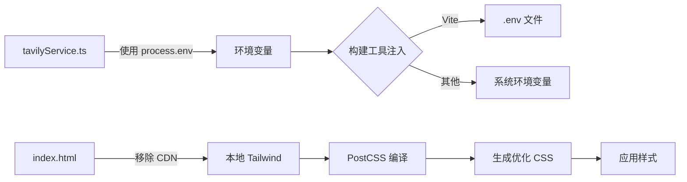

## 问题概述

应用当前存在两个关键问题导致无法正常运行：

1. **500 Internal Server Error**：由 tavilyService.ts 中使用 `import.meta.env.VITE_TAVILY_API_KEY` 导致的运行时错误
2. **Tailwind CSS CDN 警告**：index.html 中使用 Tailwind CDN，不适合生产环境，需替换为本地 PostCSS 配置

## 核心功能

- 修复环境变量引用方式，确保在所有构建环境下正常工作
- 移除 Tailwind CDN，配置本地 Tailwind CSS 构建流程
- 确保应用能够正常启动和运行

## 技术方案

### 问题分析

#### 500 错误根源

`import.meta.env` 是 Vite 特定的环境变量访问方式，在某些构建或运行时环境下（如 SSR、非 Vite 构建工具）可能无法识别，导致 500 错误。需要使用更通用的环境变量访问方式。

#### Tailwind CDN 问题

Tailwind CDN 仅适合原型开发，生产环境存在以下问题：

- 性能差：包含完整 CSS，体积大
- 功能受限：无法使用自定义配置和插件
- 不稳定：依赖外部 CDN 可用性

### 技术实现方案

#### 1. 修复环境变量访问

**问题定位**

- 文件：`tavilyService.ts` 第 23 行
- 问题代码：`import.meta.env.VITE_TAVILY_API_KEY`

**解决方案**
使用 `process.env` 替代 `import.meta.env`，并确保构建工具正确注入环境变量：

```typescript
// 修改前
const apiKey = import.meta.env.VITE_TAVILY_API_KEY;

// 修改后
const apiKey = process.env.VITE_TAVILY_API_KEY || process.env.TAVILY_API_KEY;
```

**环境变量配置**
在项目根目录创建 `.env` 文件（如果不存在）：

```
VITE_TAVILY_API_KEY=your_api_key_here
```

#### 2. 本地化 Tailwind CSS

**移除 CDN**
从 `index.html` 第 10 行移除：

```html
<!-- 移除这行 -->
<script src="https://cdn.tailwindcss.com"></script>
```

**安装依赖**

```
npm install -D tailwindcss postcss autoprefixer
npx tailwindcss init -p
```

**配置文件结构**

```
project-root/
├── tailwind.config.js    # Tailwind 配置文件
├── postcss.config.js     # PostCSS 配置文件
└── src/
    └── index.css         # 主样式文件，引入 Tailwind 指令
```

**Tailwind 配置示例**

```javascript
// tailwind.config.js
module.exports = {
  content: [
    "./index.html",
    "./src/**/*.{js,ts,jsx,tsx}",
  ],
  theme: {
    extend: {},
  },
  plugins: [],
}
```

**样式入口文件**
在 `src/index.css` 中添加 Tailwind 指令：

```css
@tailwind base;
@tailwind components;
@tailwind utilities;
```

**主文件引入**
在 `src/main.ts` 或 `src/main.tsx` 中引入样式：

```typescript
import './index.css';
```

### 数据流



### 验证策略

1. **环境变量验证**：添加启动时环境变量检查，确保必需的 API key 存在
2. **样式验证**：检查 Tailwind 样式是否正确应用，测试响应式和自定义类
3. **构建测试**：执行生产构建，验证无警告和错误
4. **运行时测试**：启动应用，确认无 500 错误且样式正常显示

### 性能优化

- **PurgeCSS 自动启用**：Tailwind 在生产构建时自动移除未使用的 CSS
- **样式压缩**：PostCSS 配合 autoprefixer 优化 CSS 输出
- **缓存优化**：编译后的 CSS 文件可被浏览器缓存