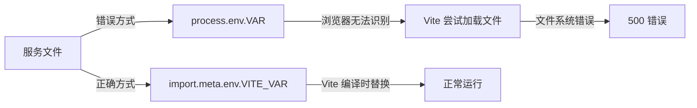

## 产品概述

修复 Vite + React 项目中因浏览器环境下错误使用 process.env 导致的 500 错误。

## 核心功能

- 将所有服务文件中的 process.env 替换为 import.meta.env.VITE_*
- 更新 vite.config.ts 的 define 配置，确保环境变量在浏览器环境中可访问
- 验证所有环境变量访问点已正确迁移
- 确保应用在浏览器中正常运行，不再出现文件系统路径错误

## 技术栈

- 前端框架：React + TypeScript
- 构建工具：Vite
- 环境变量管理：import.meta.env (Vite 标准方式)

## 技术架构

### 问题根源

在 Vite 项目中，浏览器环境无法访问 Node.js 的 `process.env`。当代码尝试访问 `process.env` 时，Vite 会尝试从文件系统加载模块（导致 `@fs/D:/` 路径错误），最终返回 500 错误。

### 解决方案

使用 Vite 的标准环境变量访问方式：`import.meta.env.VITE_*`



## 实现细节

### 核心目录结构

```
project-root/
├── src/
│   ├── config/
│   │   └── config.ts           # 修改：环境变量访问方式
│   └── services/
│       ├── difyService.ts      # 修改：环境变量访问方式
│       └── tavilyService.ts    # 修改：环境变量访问方式
└── vite.config.ts              # 修改：define 配置
```

### 技术实现方案

#### 1. 替换服务文件中的环境变量访问

**问题**：config.ts:68, difyService.ts:14, tavilyService.ts:23 使用 `process.env`

**解决方案**：

- 将 `process.env.VARIABLE_NAME` 替换为 `import.meta.env.VITE_VARIABLE_NAME`
- 确保所有环境变量名以 `VITE_` 前缀开头

**实施步骤**：

1. 在 config.ts 中查找所有 `process.env` 引用并替换
2. 在 difyService.ts 中查找所有 `process.env` 引用并替换
3. 在 tavilyService.ts 中查找所有 `process.env` 引用并替换
4. 更新 .env 文件，确保所有变量名以 `VITE_` 开头

**验证策略**：

- 搜索代码库中所有 `process.env` 引用，确保无遗漏
- 本地运行应用，验证 500 错误是否消失

#### 2. 更新 vite.config.ts

**问题**：可能需要更新 define 配置以确保环境变量正确注入

**解决方案**：

- 移除或更新 define 配置中的 `process.env` 相关定义
- 确保 Vite 的环境变量加载机制正常工作

**实施步骤**：

1. 检查 vite.config.ts 中的 define 配置
2. 移除 `'process.env': {}` 或类似的错误配置
3. 如需要，添加正确的环境变量类型定义

**验证策略**：

- 重启开发服务器，验证环境变量是否正确加载
- 检查浏览器控制台，确保无环境变量相关错误

### 集成点

- 所有服务文件必须统一使用 `import.meta.env.VITE_*`
- .env 文件中的变量名必须以 `VITE_` 前缀开头
- Vite 配置需支持环境变量的正确编译和注入

## 技术考量

### 性能优化

- 使用 `import.meta.env` 的环境变量在构建时会被静态替换，无运行时开销

### 安全措施

- 敏感环境变量（如 API 密钥）会在构建时暴露到前端代码中，需确保不泄露敏感信息
- 仅在前端需要的变量使用 `VITE_` 前缀